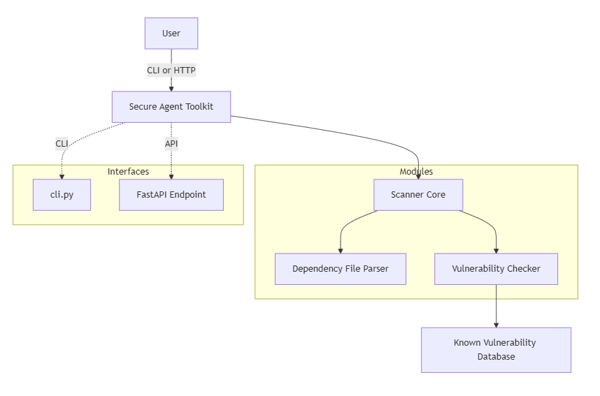
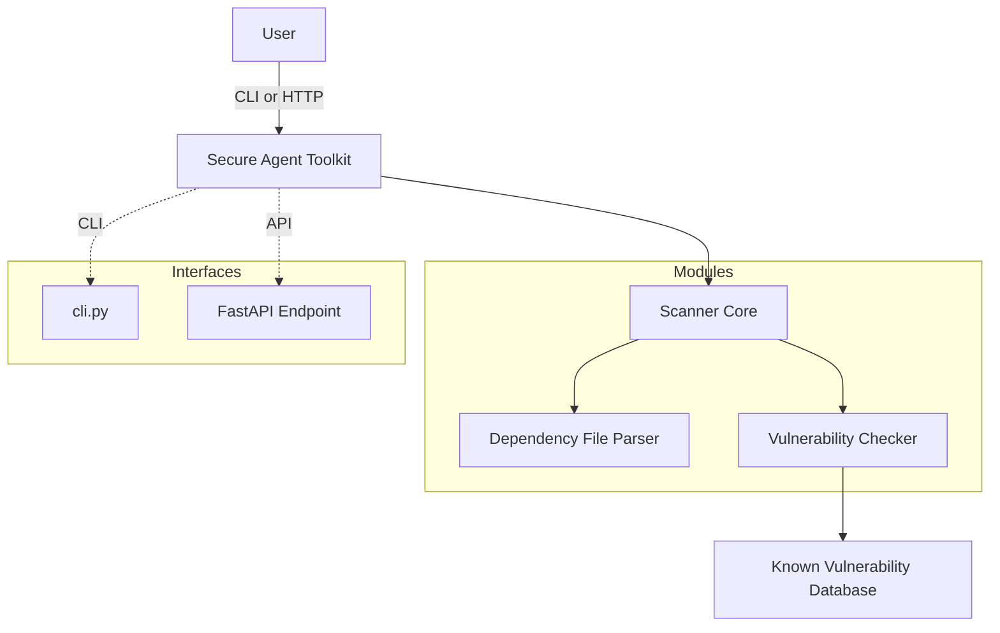

# 🛡️ Secure Agent – Dependency Vulnerability Scanner

**Secure Agent** is a containerized CLI tool that performs automated vulnerability scans on Python dependency files like `requirements.txt`. Designed with DevSecOps in mind, it seamlessly integrates into CI/CD pipelines to ensure that no vulnerable packages make it to production.

> 🚀 Secure Agent scans your Python dependencies and flags known vulnerabilities using a simple CLI that can be run in CI, staging, or locally.

---
## 🏗 Architecture Diagram


---

## 📦 Features

- 🔍 Scans Python `requirements.txt` files for known vulnerabilities
- 🧪 Containerized with Docker for portability and isolation
- 🧰 Easily integrable with CI/CD pipelines (e.g., GitHub Actions)
- ✅ Supports both safe and unsafe dependency test cases
- 🧼 Fails pipeline gracefully if critical vulnerabilities are found

---

## 🛠 Project Structure
```plaintext
secure-agent/
├── Dockerfile
├── cli.py
├── scanner/
│   ├── __init__.py
│   └── core.py
├── test_data/
│   ├── safe_requirements.txt
│   └── unsafe_requirements.txt
├── .github/
│   └── workflows/
│       └── ci.yml
├── requirements.txt
├── README.md
└── tests/
   └── test_scanner.py
```




---

## 🐳 Docker Usage

### 🔧 Build the Docker Image

```bash
docker build -t secure-agent:latest .
```

🔍 Run a Scan on requirements.txt

```bash
docker run --rm \
  -v $(pwd)/test_data:/home/agentuser/app/test_data \
  secure-agent:latest \
  agent scan test_data/unsafe_requirements.txt
```

⚙️ CLI Usage
```bash
python cli.py scan <path-to-requirements.txt>

**Example:**
python cli.py scan test_data/unsafe_requirements.txt
✅ Sample Test Data
Located in the test_data/ directory:
```

## 🤖 GitHub Actions CI/CD

This project includes a robust GitHub Actions CI pipeline located in `.github/workflows/ci.yml`. It:

- Builds the Docker image  
- Runs tests using `pytest`  
- Performs a self-scan using `unsafe_requirements.txt`  
- Fails the pipeline if vulnerabilities are detected  

### 🚀 Triggered on:

- `push` to `main`  
- `pull_request` to `main`  

---

## 🧪 Running Tests

```bash
pytest tests/
```
## 📦 Installation (For Local Dev)

```bash
pip install -r requirements.txt
```

## 🛡️ Security Notes

- No data is sent to external APIs. All scanning is performed locally.
- Ensure regular updates to the vulnerability database if using a custom DB.
- Future integrations may include platforms like [OSV](https://osv.dev) or [Snyk](https://snyk.io) for enhanced vulnerability detection.

## 👨‍💻 Contributing

Pull requests are welcome! To contribute:

1. Fork the repository  
2. Create your feature branch:  
   ```bash
   git checkout -b feature/foo
    ```
3. Commit your changes:
    ```bash
   git commit -am 'Add some foo'
    ```
4. Push to the branch:
    ```bash
   git push origin feature/foo
    ```

## 📄 License

MIT License © 2025 Edet Emmanuel Asuquo
